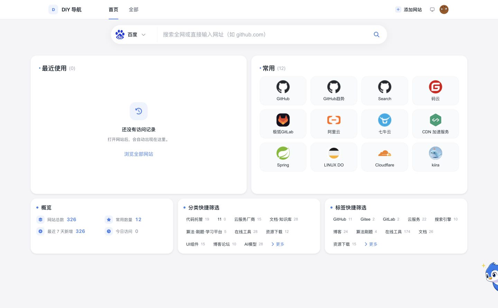
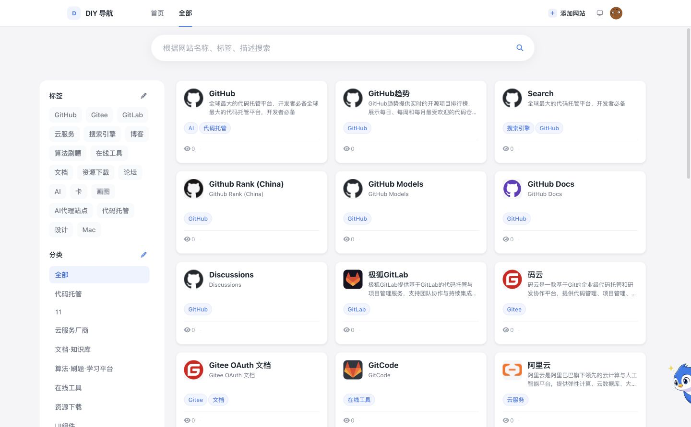
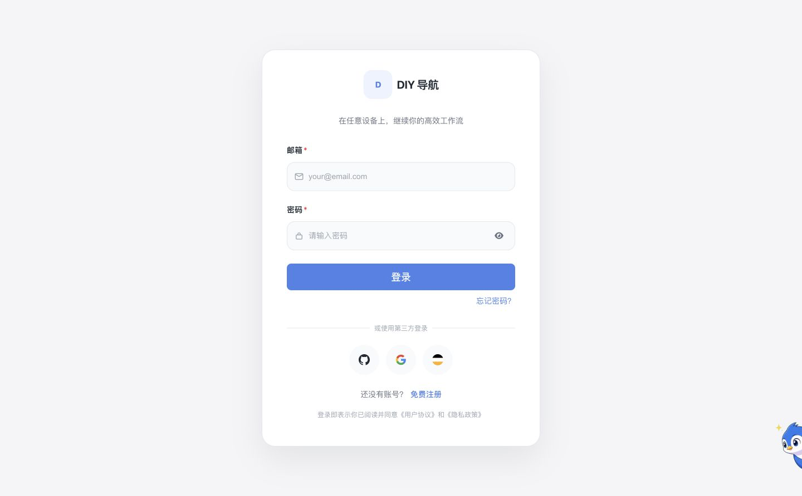
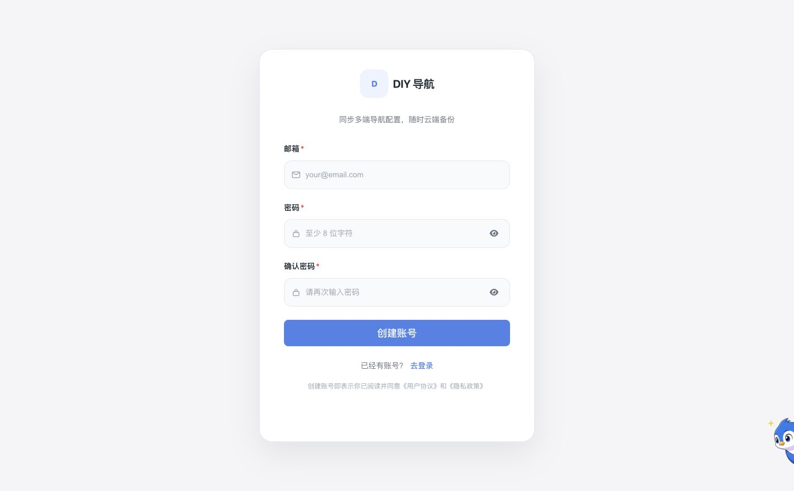
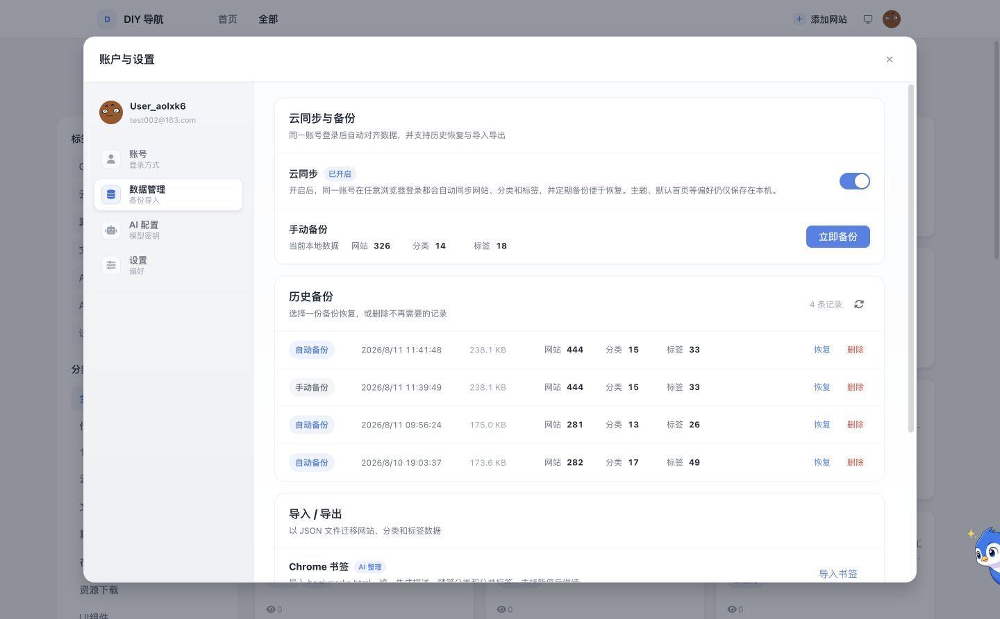
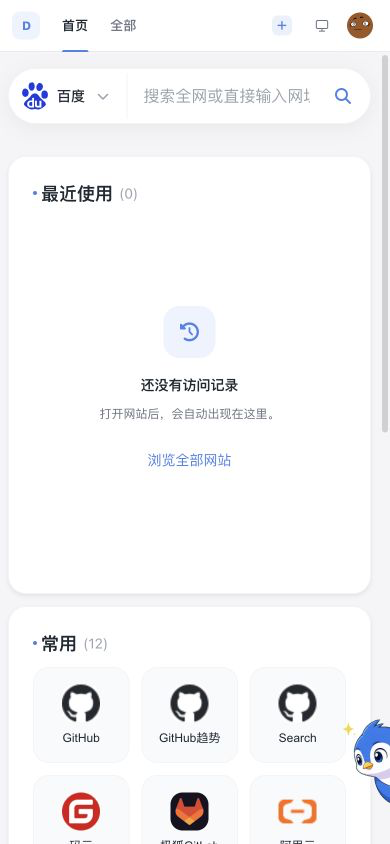

# DIY NAV WEB

[](LICENSE)
[](https://nodejs.org/)
[](https://vuejs.org/)
[](https://fastify.dev/)
[](https://www.typescriptlang.org/)
[](https://1ddh.cn)

> 一个本地优先、支持云同步与 AI 批量整理的个人导航管理平台。

[在线体验](https://1ddh.cn) · [快速开始](#快速开始) · [部署](#docker-部署)

## 项目简介

DIY NAV WEB 用于集中管理网站、分类和标签。未登录时数据保存在当前浏览器；登录后可以开启跨设备同步、创建历史备份，并在数据冲突或云端快照异常时进行恢复。

项目采用 pnpm + Turborepo Monorepo：Web 端基于 Vue 3，API 基于 Fastify，数据与对象存储使用 Cloudflare D1、R2，也支持 WebDAV 和本地对象存储。AI 能力支持用户配置多个 OpenAI 或 Claude 协议服务。

## 核心功能

| 能力            | 说明                                                                                        |
| :-------------- | :------------------------------------------------------------------------------------------ |
| 导航管理        | 网站增删改查、常用与最近使用、拖拽排序、访问统计。                                          |
| 搜索与筛选      | 根据名称、描述、分类和标签实时检索，支持组合筛选。                                          |
| 分类与标签      | 独立管理分类和标签，并在网站卡片中展示整理结果。                                            |
| 响应式界面      | 桌面端与移动端布局，支持浅色、深色和跟随系统主题。                                          |
| 账号与同步      | 邮箱注册登录，支持 GitHub、Google、Linux.do OAuth 与登录方式绑定。                          |
| 备份与迁移      | 自动/手动备份、历史恢复、JSON 导入导出、备份数量与内容统计。                                |
| AI 助手         | 通过对话管理网站、分类、标签和备份，自动生成描述并完成归类。                                |
| Chrome 书签整理 | 导入 `bookmarks.html`，统一规划分类标签，分批生成描述、归类并获取网站图标，支持暂停后继续。 |
| 多 AI 服务      | 配置多个 OpenAI/Claude 协议服务，获取模型、测试连接并设置默认服务。                         |

## 最新界面

以下截图来自当前本地代码和测试数据，桌面端尺寸为 1440 × 892。

### 核心页面

|             首页             |               全部网站                |
| :--------------------------: | :-----------------------------------: |
|  |  |

### 登录、备份与移动端

|             登录              |               注册               |
| :---------------------------: | :------------------------------: |
|  |  |

|              备份               |                              移动端首页                              |                                移动端全部网站                                 |
| :-----------------------------: | :------------------------------------------------------------------: | :---------------------------------------------------------------------------: |
|  |  |  |

### AI 助手

|             AI 助手             |        AI 助手：添加网站         |
| :-----------------------------: | :------------------------------: |
|  |  |

|         AI 助手：添加标签          |        AI 助手：备份数据         |        AI 助手：查看备份数据         |
| :--------------------------------: | :------------------------------: | :----------------------------------: |
|  |  |  |

## 技术栈

| 层级     | 技术                                                           |
| :------- | :------------------------------------------------------------- |
| Web      | Vue 3.5、TypeScript、Vite 6、Pinia 3、Vue Router、SCSS         |
| API      | Node.js 20+、Fastify 5、Zod、JWT                               |
| AI       | OpenAI Compatible API、Claude API、多 Provider 注册与调用      |
| 数据库   | Cloudflare D1                                                  |
| 对象存储 | Cloudflare R2、WebDAV、本地存储                                |
| 工程化   | pnpm Workspace、Turborepo、ESLint、Stylelint、Prettier、Vitest |
| 部署     | Docker、Docker Compose、Nginx                                  |

## 项目结构

```text
.
├── apps
│   ├── web                 # Vue Web 应用
│   └── api                 # Fastify API 服务
├── packages
│   ├── ai-core             # AI 协议、Provider 与结构化输出
│   ├── auth-providers      # GitHub、Google、Linux.do OAuth
│   ├── config              # 环境配置
│   ├── core                # 认证、同步、备份等领域服务
│   ├── database            # Cloudflare D1 客户端
│   ├── icon-core           # 网站图标获取
│   ├── storage             # R2、WebDAV、本地存储
│   ├── types               # 共享类型
│   └── ui                  # 共享 UI 组件
├── deploy                  # Docker Compose 与部署脚本
├── doc/images              # README 截图
└── README.md
```

## 快速开始

### 环境要求

- Node.js 20 或更高版本
- pnpm 8 或更高版本
- Cloudflare D1 与 R2 凭据，或可用的同类开发配置
- Docker 与 Docker Compose（仅 Docker 部署需要）

### 安装依赖

```bash
git clone https://github.com/slightlee/diy-nav-web.git
cd diy-nav-web
pnpm install
```

### 配置环境变量

```bash
cp .env.example .env
```

完整配置和注释以 [`.env.example`](.env.example) 为准。至少需要根据部署方式检查以下配置：

| 分组  | 关键变量                                                                                            | 说明                                                 |
| :---- | :-------------------------------------------------------------------------------------------------- | :--------------------------------------------------- |
| 应用  | `NODE_ENV`、`APP_PORT`                                                                              | API 运行模式和端口。                                 |
| D1    | `STORAGE_R2_ACCOUNT_ID`、`DB_D1_API_TOKEN`、`DB_D1_DATABASE_ID`                                     | 用户、同步、AI 配置等结构化数据。                    |
| R2    | `STORAGE_R2_ENDPOINT`、`STORAGE_R2_ACCESS_KEY_ID`、`STORAGE_R2_SECRET_ACCESS_KEY`、`STORAGE_BUCKET` | 图标、头像、备份和同步快照。                         |
| 存储  | `PUBLIC_STORAGE_PROVIDER`、`BACKUP_STORAGE_PROVIDER`                                                | 当前支持 `r2`、`webdav` 和 `local`，按用途分别配置。 |
| 认证  | `JWT_SECRET`、`WEB_APP_URL`                                                                         | 生产环境必须使用强随机 JWT 密钥。                    |
| OAuth | `OAUTH_CONFIG_ENCRYPTION_KEY`                                                                       | 平台配置保存在数据库，环境变量仅保存主加密密钥。     |
| AI    | `AI_OPENAI_API_KEY`、`AI_OPENAI_BASE_URL`、`AI_OPENAI_MODEL`                                        | 可选的系统级 AI 服务；用户也可登录后在界面中配置。   |
| 前端  | `VITE_API_BASE_URL`、`VITE_BASE`、`VITE_USE_HASH_ROUTER`                                            | API 地址、部署子路径和路由模式。                     |

不要提交真实 Token、Secret、API Key 或 WebDAV 密码。用户在界面中保存的 AI Key 会在服务端加密后写入数据库。

#### 配置第三方登录

OAuth 平台配置保存在 `oauth_provider_configs` 表中，API 启动时会自动创建该表。

先在 `.env` 中设置 `OAUTH_CONFIG_ENCRYPTION_KEY`，再生成 Client Secret 密文：

```bash
pnpm --filter api exec node --input-type=module -e "import { encrypt } from '@nav/ai-core'; import { config } from '@nav/config'; console.log(encrypt(process.argv[1], config.auth.oauthConfigEncryptionKey))" "替换为 Client Secret"
```

然后在数据库中填写：

| 字段                      | 说明                            |
| :------------------------ | :------------------------------ |
| `provider`                | `github`、`google` 或 `linuxdo` |
| `enabled`                 | `1` 启用，`0` 停用              |
| `client_id`               | 第三方平台提供的 Client ID      |
| `client_secret_encrypted` | 上述命令生成的密文              |
| `redirect_uri`            | 第三方平台登记的完整回调地址    |

Redirect URI 必须与第三方平台后台完全一致。请妥善保管主加密密钥；密钥丢失或更换后，已有密文将无法解密。

### 启动开发环境

```bash
# 同时启动 Web、API 和内部包的开发任务
pnpm dev
```

- Web: [http://localhost:3000](http://localhost:3000)
- API: [http://localhost:8787](http://localhost:8787)
- 健康检查: [http://localhost:8787/healthz](http://localhost:8787/healthz)

也可以分别启动：

```bash
pnpm dev:web
pnpm dev:api
```

## 数据与同步

- 浏览器数据采用本地优先策略，未登录也可以管理导航。
- 开启云同步后，网站、分类和标签会在同一账号的设备间同步。
- 写入同步快照前会校验版本，避免静默覆盖其他设备上的更新。
- 自动备份和手动备份均可在历史列表中恢复或删除。
- JSON 导入只覆盖文件中包含的对应数据；执行覆盖操作前请先创建备份。
- 主题、默认首页等偏好与导航数据分开管理。

## 质量检查

```bash
pnpm type-check
pnpm lint
pnpm stylelint
pnpm test
pnpm build
```

提交前可执行完整校验：

```bash
pnpm ci:verify
```

## Docker 部署

```bash
cp .env.example .env
# 修改 .env 中的生产配置
sh deploy/deploy.sh
```

脚本会使用当前 Git Tag；没有 Tag 时使用当前 Commit SHA 构建并启动 `nav-web` 与 `nav-api` 容器。

- Web: `http://localhost:3000`
- API: `http://localhost:8787`

## 贡献

1. Fork 本仓库。
2. 创建功能分支：`git checkout -b feat/example`。
3. 完成修改并执行质量检查。
4. 按 [Conventional Commits](https://www.conventionalcommits.org/) 规范提交。
5. 推送分支并创建 Pull Request。

## Star History

[](https://star-history.com/#slightlee/diy-nav-web&Date)

## 许可证

本项目基于 [MIT License](LICENSE) 开源。
